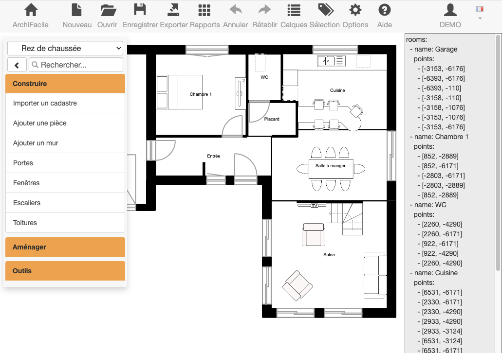

# ESPresense-plugin

Plugin pour archifacile.fr permettant un export vers ESPresense. Le script YAML à droite se met à jour à chaque modification du plan.

Ce n'est pas encore complet mais c'est une bonne base pour se simplifier la vie.

https://www.archifacile.fr/planenligne?load=ESPresense.js

## Modification

Téléchargez le fichier ESPresense.js sur un serveur à vous et indiquez son URL pour que archifacile.fr le charge.
Le fichier doit avoir les authorisation CORS pour qu'il puisse être chargé. Un lien direct vers github ne fonctionne pas.
Vous pouvez aussi proposer des modifications ici .
## Utilisation

Hébergé chez vous pour pouvoir le modifier :
https://www.archifacile.fr/planenligne?load=https://votredomaine.com/ESPresense.js

Version fonctionnelle hébergé sur le serveur archifacile.fr :
https://www.archifacile.fr/planenligne?load=ESPresense.js